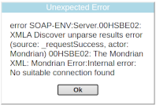

# HowTo: Installing a new OLAP cube
We use Open Source, Java JSP Apache TomCat9 based Pentaho Mondrian OLAP systems. Currently. Play with the demo first to get a feel: [http://demos.acornassociated.org/xmondrian/xavier/index.html](http://demos.acornassociated.org/xmondrian/xavier/index.html)

## Read the documentation
- [Pentaho Documentation](https://mondrian.pentaho.com/documentation/olap.php)

## Related, useful technologies
- [XML language Documentation](https://en.wikipedia.org/wiki/XML)
- [Linux Permissions](https://linuxhandbook.com/linux-file-permissions/)

## Clone the office/scripts repository
Our scripts setup Apache2 websites in the standard `/var/www/` directory.
```
cd /var/www/
git clone git@gitlab.acornassociated.org:office/scripts.git
```
This will provide many scripts that should be run in the `/var/www/` directory like this:
```
cd /var/www/
./scripts/acorn-setup-hostname
```
However, permissions are important. The scripts will add you to the Apache2 user group `www-data`. Follow the instructions that the scripts give you. `/var/www/` is owned by `www-data`. After creating or changing websites, ensure that everything is owned by `www-data` include caches in the `/storage/` area with the following commands:
```
cd /var/www/<website>
sudo chmod -R g+rw .
sudo chown -R www-data:www-data .
```
This will also fix `file_put_contents()` cache write issues.

## Install the administration website
e.g. universityacceptance. This will also install the postgres database. You can use the GitLab `office/scripts` script `acorn-git-clone` to do this in 1 command, e.g.
```
cd /var/www/
./scripts/acorn-git-clone jaber1/university-acceptance
```
This script also calls acirn-setup-* scripts and also WinterCMS artisan scripts to setup up the whole website. By default the website and database have the same names as the project.
[http://<project-name>.laptop/](http://<project-name>.laptop/) connects to database \<project-name\> etc. The database connection can be viewed in the Laravel `.env` file. Note that all non alphanumeric characters will be removed, e.g. university-acceptance goes to universityacceptance.

## Install the OLAP system
You can use the `office/scripts` script `acorn-setup-olap <project-name>`, e.g. `acorn-setup-olap universityacceptance`. Note that -_ are all removed. This will install TomCat9 and its Java PostGreSQL driver.

## Go to `/var/lib/tomcat9/webapps/xmondrian/WEB-INF/`
This is the root of the configuration of the OLAP system. All the files are here.

## Check datasources.xml
It should contain your connection(s) to the administration system PostGreSQL database. Something like this:

```
<DataSource>
  <DataSourceName>universityacceptance</DataSourceName>
  <DataSourceDescription>Acorn Associated Calendar system</DataSourceDescription>
  <URL>http://localhost:8080/xmondrian/xmla</URL>
  <DataSourceInfo>
    Provider=mondrian;
    Jdbc=jdbc:postgresql://localhost:5432/universityacceptance;
    JdbcDrivers=org.postgresql.Driver;
    JdbcUser=universityacceptance;
    JdbcPassword=QueenPool1@;
    Catalog=/WEB-INF/schema/universityacceptance.xml;
    UseSchemaPool=false
  </DataSourceInfo>
  <ProviderName>Mondrian</ProviderName>
  <ProviderType>MDP</ProviderType>
  <AuthenticationMode>Unauthenticated</AuthenticationMode>
  <Catalogs>
      <Catalog name="universityacceptance">
          <Definition>/WEB-INF/schema/universityacceptance.xml</Definition>
      </Catalog>
  </Catalogs>
</DataSource>
```
There can be only 1 Datasource because of a bug in our Java OLAP system. All values should be the same as the `.env` values. Note the `UseSchemaPool=false` that turns off cacheing.

## Error solving


The OLAP interface will give useless errors. Often it will just say "**No suitable connection found**". In order to understand the real error goto `/var/log/tomcat9/mondrian.log`. You will see detailed problems like:

- `Caused by: org.postgresql.util.PSQLException: FATAL: password authentication failed for user "universityacceptancea"`
- `Mondrian Error:Internal error: Virtual file is not readable: /var/lib/tomcat9/webapps/xmondrian/WEB-INF/schema/universityacceptancea.xml`

In order to see the errors from a request do this:
- Delete the log
- Refresh your cube interface or run your pivot table query
- Restart TomCat9
- Read the log

The best way to see errors is to actually open the `/var/log/tomcat9/mondrian.log` in your IDE. You need to add yourself to the `adm` linux group to access the log file: `sudo usermod -a -G adm $USER`. You must log out and in again to see the changes to user groups.

## Edit / Add a Schema (Catalog)
Schemas live in `./schema/*.xml`. It should have the same name as your project, e.g. `universityacceptance.xml`. It will contain the definition of your cubes. The `datasources.xml` Catalog property points to the schema you use. If you do not have `UseSchemaPool=false` in your `<DataSourceInfo>` then it is necessary to restart TomCat9 to see your schema changes: `sudo systemctl restart tomcat9`.

## AcornAssociated Schema culture
We don't generally use @hasAll because it is too verbose.

## JavaScript control of the XavierApplication
In `acorn-setup-olap`, `xavier/index.html` is patched to make `xavierApplication` available on `window`. Thus manouveurs like this become possible:
```
xavierApplication.createVisualizationTab({id:'pivot-table'})
xavierApplication.workArea.tabs[xavierApplication.workArea.selectedTab].queryDesigner
```
